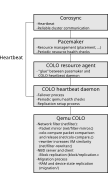

# Qemu COLO heartbeat daemon

Author: Lukas Straub <lukasstraub2@web.de> with code from the qemu project

This project provides a robust cluster manager and heartbeat daemon designed for [Qemu Coarse-grained Lock-stepping (COLO)](https://wiki.qemu.org/Features/COLO). Qemu COLO offers a high-availability solution for virtual machines (VMs) by utilizing a software-based approach to hardware fault tolerance.

## COLO heartbeat daemon

This daemon provides a complete cluster manager and heartbeat solution for Qemu COLO.

It offers automatic failover, ensuring seamless transition to the secondary VM in case of a primary VM failure. Moreover, it provides fully automatic resynchronization and restart of the replication process (failback) when the failed node comes online again.

## Qemu COLO

In Qemu COLO, both a primary VM and a secondary VM operate concurrently. They process identical client requests and generate responses in parallel. A continuous comparison of these responses ensures consistency. As long as the VMs are in sync, response packets match and are are released as usual. If a a response mismatch occurs, the VMs are not in sync and the primary VM state checkpoint is replicated to the secondary VM to bring them in sync again.

## Technical Stack

